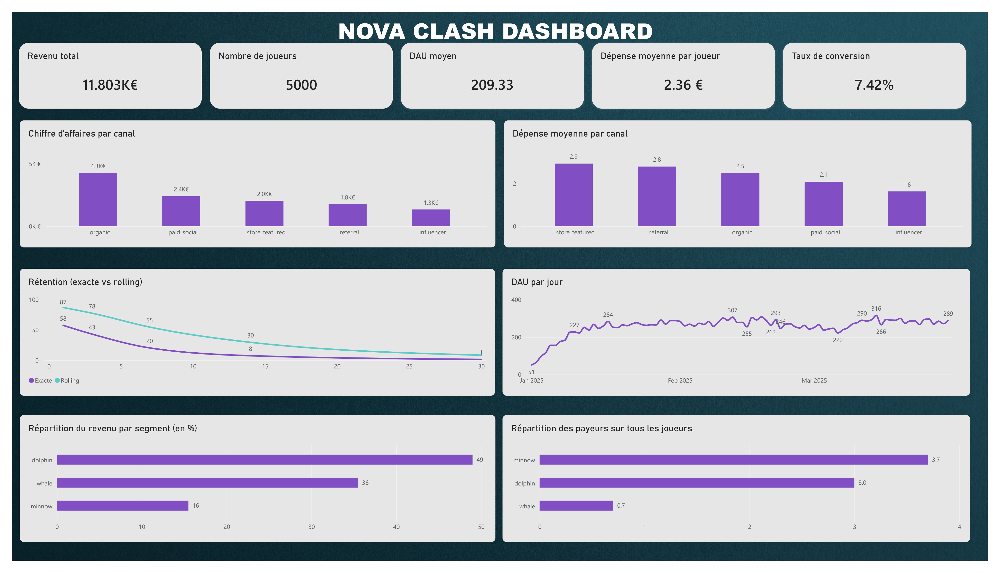

# Nova Clash — Analyse de données & Tableau de bord

Analyse des données de jeu (sessions, achats, joueurs) pour en extraire des indicateurs clés de performance (KPI) et un tableau de bord décisionnel.

## 📊 Aperçu du Dashboard

## 📁 Contenu du dépôt

- `analyse_nova_clash.sql` : Requêtes SQL d'analyse (indicateurs, rétention, chiffre d'affaires).
- `database_setup.sql` : Script de création et d'alimentation de la base de données SQLite.
- `dashboard.png` / `dashboard.pbix` : Visuels du tableau de bord Power BI.

## 🛠️ Outils utilisés

- **SQL** (DB Browser for SQLite)
- **Power BI**
